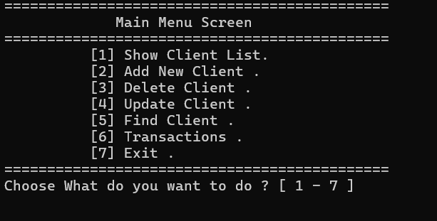
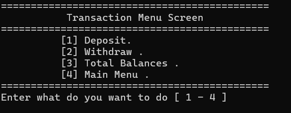

# Bank Client Management System

## Overview
This C++ program simulates a basic Bank Client Management System, allowing the user to manage client records and perform transactions. The system offers various functionalities like viewing, adding, updating, and deleting clients, as well as performing transactions such as deposits and withdrawals.

The client information is stored in a text file (`Client.txt`) and includes the following details for each client:
- Account Number
- Pin Code
- Client Name
- Phone Number
- Account Balance

The system also supports viewing total balances of all clients and managing client accounts effectively.

## Features
- **Client Management:**
  - View a list of all clients.
  - Add a new client.
  - Update client details.
  - Delete a client from the system.
  - Find a specific client by their account number.
 

  
- **Transactions:**
  - Deposit funds into a client's account.
  - Withdraw funds from a client's account.
  - Display total balances of all clients.
 
  


## File Format (`Client.txt`)
Each line in the `Client.txt` file contains the following fields, separated by the delimiter `#//#`:
- Account Number
- Pin Code
- Client Name
- Phone Number
- Account Balance

Example:
1 - ###A152#//#4321#//#Ahmed#//#054457659#//#2500
2 - ### A125#//#4789#//#Salme#//#050147896#//#5000
---

## Functions
The program is divided into several functions that handle different tasks:

### Menu Functions
- `ShowMenuScreen()`: Displays the main menu and accepts user input for actions.
- `TransactionMenuScreen()`: Displays the transaction menu for deposit, withdrawal, or balance inquiry.
  
### Client Management
- `AddClient()`: Adds a new client to the system.
- `UpdateClientInfo()`: Updates details of an existing client.
- `DeleteClient()`: Deletes a client by marking them as deleted.
- `FindClient()`: Finds a client by account number.

### Transaction Functions
- `Deposit()`: Allows a user to deposit funds into a client's account.
- `Withdraw()`: Allows a user to withdraw funds from a client's account.
- `TotalBalances()`: Displays the total balance of all clients.

### File Operations
- `LoadDataFromFileToVector()`: Loads all client data from the `Client.txt` file into a vector of client structures.
- `SaveClientToTheFile()`: Saves the updated list of clients back to the `Client.txt` file.


## 📥 How to Download the Project  

To get started, **clone the repository** or download the project manually.

### ✅ **Clone the Repository (Recommended)**
If you have Git installed, open a terminal (Command Prompt, Git Bash, or PowerShell) and run:

```bash
git clone https://github.com/mohammednasser249/Bank-System.git
```
# 🎮 Bank System (C++)
### 🚀 How to Run the System  

You can run this game using either **Visual Studio** or **Code::Blocks**. Follow the instructions below based on your preferred environment.

---

## 🟣 Option 1: Using Visual Studio  
If you're using **Microsoft Visual Studio**, follow these steps:

### ✅ **Steps to Run in Visual Studio**  
1. Open **Visual Studio**.  
2. Click on **File → Open → Project/Solution**.  
3. Select and open the **`.sln`** file (`Rock_Scissor_Paper Game.sln`).  
4. Click on **Build → Build Solution (Ctrl + Shift + B)**.  
5. Click on **Debug → Start Without Debugging (Ctrl + F5)** to run the game.  

---

## 🟢 Option 2: Using Code::Blocks  
If you're using **Code::Blocks**, follow these steps:

### ✅ **Steps to Run in Code::Blocks**  
1. Open **Code::Blocks**.  
2. Click on **File → New → Project → Console Application**.  
3. Select **C++**, then click **Next**.  
4. Enter a project name (or open an existing one).  
5. Replace the contents of `main.cpp` with the code from `"Rock_Scissor_Paper Game.cpp"`.  
6. Click **Build and Run (F9)** to compile and start the game.  

---

## 🔧 Option 3: Using g++ (MinGW) in Command Line  
If you have **MinGW installed** (which provides `g++`), you can run the game using the command line:

### ✅ **Steps to Run via g++**
1. Install **MinGW** (if not installed).
2. Open **Command Prompt (cmd)** or **Git Bash**.
3. Navigate to the project folder using:
   ```bash
   cd path/to/project
